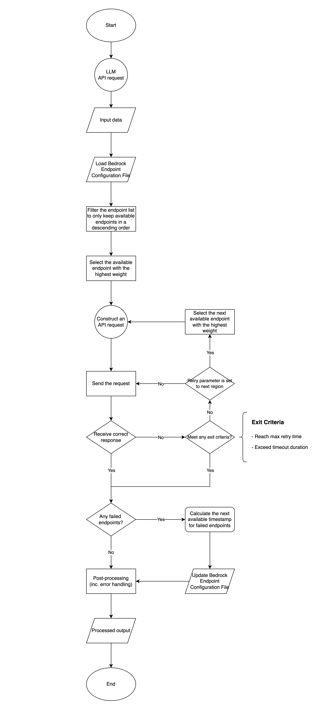

# Amazon Bedrock Connect Helper
This repository contains samples of the implementation of the Amazon Bedrock Dynamic Cross-Region Routing Solution to improve generative AI applications' resilience using the AWS SDK for Python (boto3).


## Background
Sometimes, it is really challenging to predict traffic spikes for generative AI products, especially for B2C products, as one cannot predict when products will go viral on the internet. It requires generative AI applications to build enhanced resilience during periods of peak demand.


## Dynamic Cross-Region Routing Solution
The dynamic cross-region routing solution is designed to enhance resilience of generative AI application, while minimizing code changes. The solution supports all Foundation Models (FMs) offered by Amazon Bedrock, and also extends the [Amazon Bedrock cross-region inference](https://docs.aws.amazon.com/bedrock/latest/userguide/cross-region-inference.html) feature.

The BedrockConnectHelper class is a sample implementation of the dynamic cross-region routing solution.

The dynamic cross-region routing solution has three core components:
- The cross-region routing offers a highly customizable routing strategy. It also supports Amazon Bedrock cross-region inference.
- Key configurations manage routing strategy and threshold.
- Amazon Bedrock endpoint configurations. It is a sorted list of Bedrock regional endpoints with controlling attributes for the cross-region routing strategy.

As a result, customers can enhance their applications' reliability, performance, and efficiency.

### Workflow
**The dynamic cross-region routing solution (`BedrockConnectHelper`) works:**

When the generative AI app starts an API request, the `BedrockConnectHelper` first retrieves a list of available Bedrock endpoints from the configuration file. The Bedrock endpoints will be divided into two groups: primary endpoints and normal endpoints. The primary endpoints will be prioritized over the normal endpoints.

Then, the BedrockConnectHelper sends the request to the prioritized endpoints first and tries to get the API response. When the API request throws an exception, the BedrockConnectHelper records the endpoint and selects the next prioritized endpoint and retries. This process will continue until the request succeeds or the exit criteria are met.

Then, the BedrockConnectHelper checks all the failed endpoints and sets the `next available time` for those endpoints. Finally, it returns the data.

**The workflow diagram:**


### Here are key configurations:
1. Maximum retry times: Controls how many times to retry until the process exits.
2. Multiple region retry: A boolean type that tells BedrockConnectHelper whether to always retry in a single region or if it can retry in different regions.
3. Primary region request distribution: Controls whether, when there are multiple primary endpoints, BedrockConnectHelper equally distributes the requests among them.
4. Maximum retry times before moving to the next region: In some scenarios, you may want to retry in the same region multiple times before moving to the next region.
5. Duration before the next available time: When an endpoint fails, the time window (in seconds) added to the current time to set the next available time for failed endpoints, meaning the cross-region routing module won't retry the endpoint until that time is reached.
6. Enable cross-region inference: Determines whether to use Amazon Bedrock cross-region inference feature.

### Bedrock endpoint configuration
The Bedrock endpoint configuration file contains a list of endpoints with three attributes:

1. The next available time, which is a timestamp.
2. Primary region, which can group all the endpoints into two groups (primary and normal).
3. Regional profile prefix, which is for the Amazon Bedrock cross-region inference feature.

### Please Notice
Customers can control where their inference data flows by selecting from a pre-defined set of regions, helping them comply with applicable data residency requirements and sovereignty laws. 

Please note that the regional Bedrock RPM and TPM limits must be sufficient in the AWS account for the solution to fulfill its purpose.

#### Regulations, Compliance, and Data Residency
Although none of the customer data is stored in either the primary or secondary region(s) when using dynamic cross-region routing solution or Amazon Bedrock cross-region inference, it’s important to consider that your inference data will be processed and transmitted beyond your primary region. If you have strict data residency or compliance requirements, you should carefully evaluate whether cross-region inference aligns with your policies and regulations.

## Get Started
### Prerequisites
- An [AWS account](https://aws.amazon.com/).
- Access to Bedrock and Claude 3 Haiku model in your AWS regions.
- Amazon IAM Role set up with sufficient permissions to access Amazon Bedrock. For details, see [IAM policy](https://docs.aws.amazon.com/bedrock/latest/userguide/security-iam.html)
- Sufficient limits of Bedrock Requests Per Minute (RPM) and Tokens Per Minute (TPM) in all regions listed in your [bedrock_endpoints.conf](src/bedrock_connect_helper/bedrock_endpoints.conf) file.
- An Amazon EC2 instance or deployment environment with the assigned IAM Role.
- AWS SDK for Python (boto3) installed on the Amazon EC2 instance or deployment environment.

### Run the demos 
1. **Clone the repository**
```bash
git clone "https://github.com/aws-samples/amazon-bedrock-connect-helper.git"

cd amazon-bedrock-connect-helper/src
```

2. **[Optional] Install and/or update required Python packages**

    Note: boto3 should be pre-installed on Amazon EC2 instances with Amazon Linux 2 AMI.

```bash
cd bedrock_connect_helper
pip install -r requirements.txt
cd ..
```

3. **Execute the test script**

3.1 Test the request to Bedrock Converse API by executing [main.py](src/main.py)
    
    Note: Python 3.x installation may be called `python3` rather than `python`.

```bash
python main.py
```

```bash
# Expected response:
# BEDROCK RESPONSE:
{'ResponseMetadata': {'RequestId': 'xxxxxx-xxxx-xxxx-xxxx-xxxxxxx', 'HTTPStatusCode': 200, 'HTTPHeaders': {'date': 'Tue, 27 May 2024 12:45:36 GMT', 'content-type': 'application/json', 'content-length': '185', 'connection': 'keep-alive', 'x-amzn-requestid': 'xxxxxx-xxxx-xxxx-xxxx-xxxxxxx'}, 'RetryAttempts': 0}, 'output': {'message': {'role': 'assistant', 'content': [{'text': 'Hello!'}]}}, 'stopReason': 'end_turn', 'usage': {'inputTokens': 9, 'outputTokens': 5, 'totalTokens': 14}, 'metrics': {'latencyMs': 259}}
# FAILED REGIONS: []
```

3.2 Test various of Bedrock Runtime APIs by executing [advanced_feature_tests.py](src/advanced_feature_tests.py)

The usage:
```bash
usage: advanced_feature_tests.py [-h] api_name={converse,converse_stream,invoke_model,invoke_model_with_response_stream} debug_mode={1,0}
```

Example:
```bash
python advanced_feature_tests.py converse 0
```

```bash
# Expected result:
# BEDROCK Converse API:
 Hello! 

# FAILED REGIONS: []
```


## Directories
```
./src/
  |- main.py # test script
  |- advanced_feature_tests.py
  |- bedrock_connect_helper/
    |- bedrock_connect_helper.py # BedrockConnectHelper class
    |- bedrock_connect_util.py # BedrockConnectUtil classes
    |- bedrock_endpoints.conf # An example of the list of endpoints
    |- requirements.txt
```

## Security

See [CONTRIBUTING](CONTRIBUTING.md#security-issue-notifications) for more information.

## License

This library is licensed under the MIT-0 License. See the LICENSE file.
